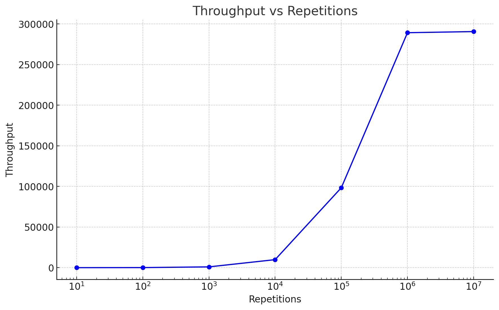
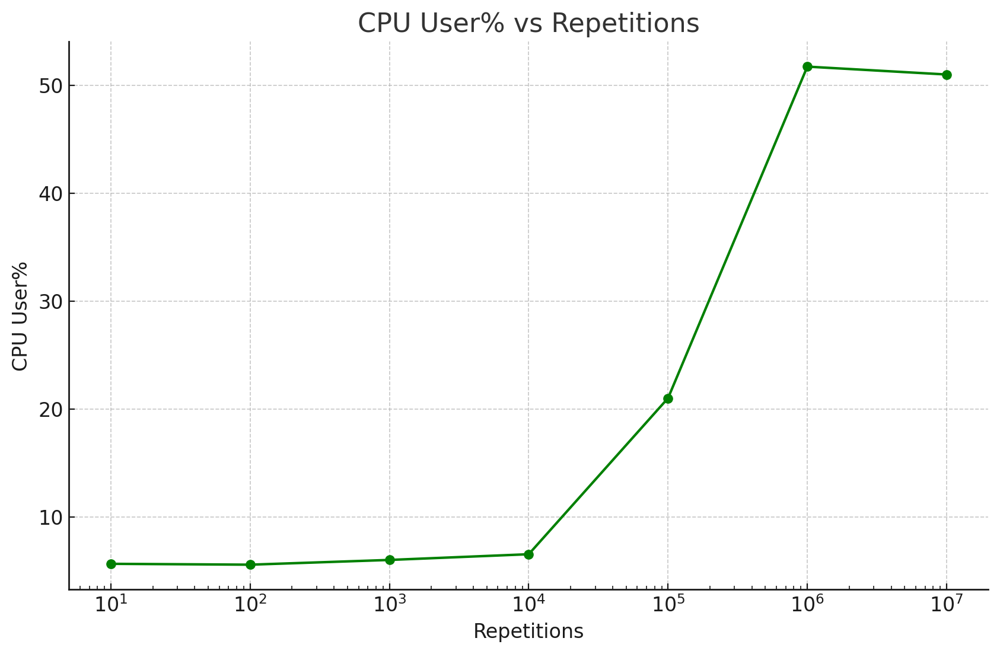
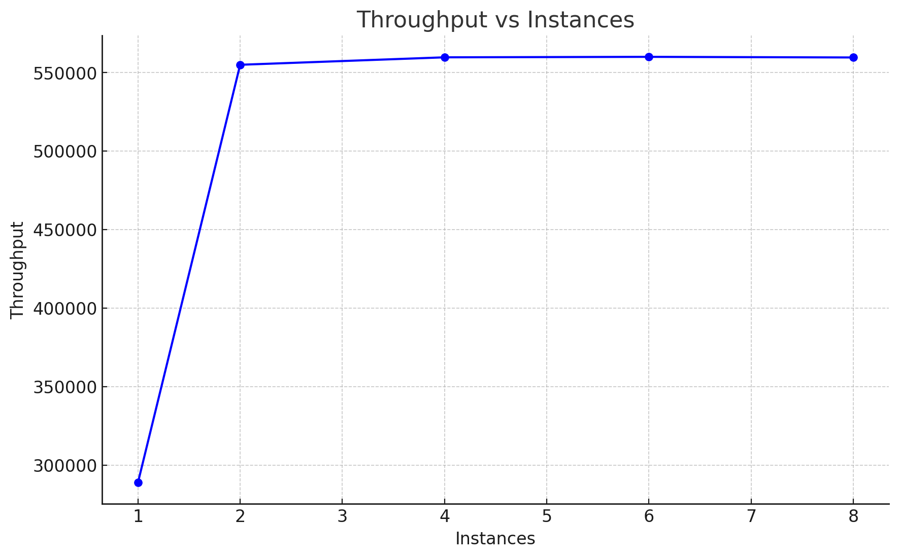
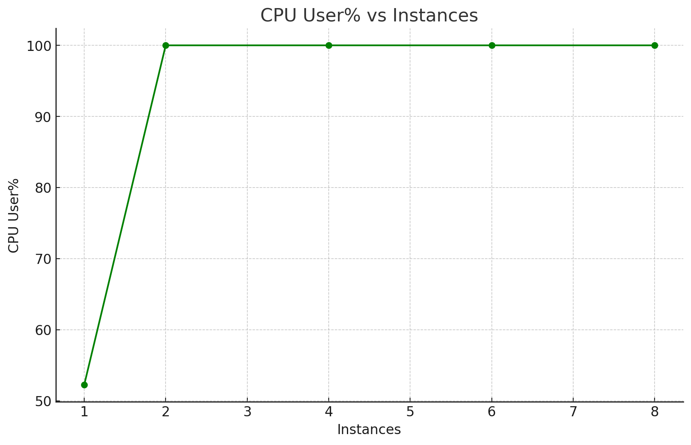
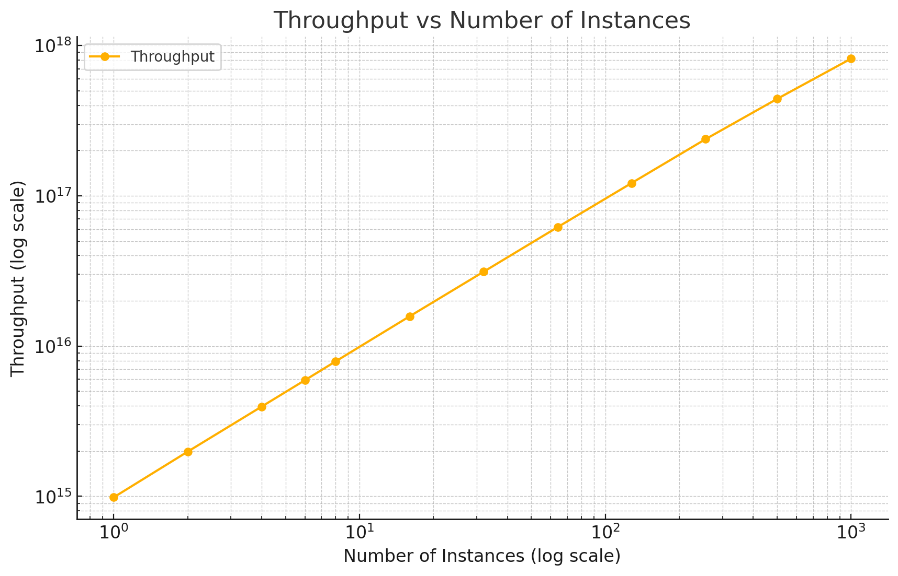
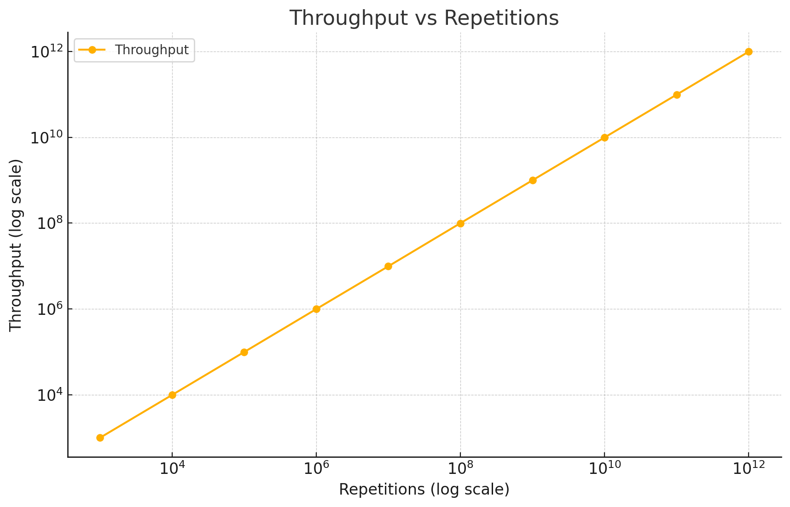

# Отчет по лабораторной работе №1 (Часть 2)

## Анализ метрик работы программы-нагрузчика `linreg.c`

В рамках выполнения второй части лабораторной работы была проведена профилировка программы-нагрузчика `linreg.c` с использованием инструмента `mpstat`. Цель экспериментов заключалась в анализе производительности программы и профилировании её работы для определения оптимального количества повторений и параллельных экземпляров.

### Эксперимент 1: Определение оптимального количества повторений

Для анализа зависимости производительности программы от количества повторений были построены графики `output11.png` (пропускная способность) и `output12.png` (загрузка CPU).

- **График `output11.png`:** Пропускная способность программы (количество вычислений в секунду) увеличивается с ростом числа повторений. Наилучшая пропускная способность достигается при 10⁶ повторениях. После этого значение пропускной способности перестаёт существенно расти.

- **График `output12.png`:** Загрузка CPU (USER%) также растёт с увеличением числа повторений и достигает 50% при 10⁶ повторениях. Это указывает на эффективное использование ресурсов процессора программой при данном числе повторений.

**Вывод:** Оптимальным числом повторений для программы является 10⁶, так как это число обеспечивает максимальную пропускную способность при разумной загрузке CPU.

### Эксперимент 2: Определение оптимального числа параллельных экземпляров

После определения оптимального числа повторений (10⁶) был проведён эксперимент для анализа влияния числа параллельных экземпляров программы на её производительность. Графики `output13.png` (пропускная способность) и `output14.png` (загрузка CPU) показывают полученные результаты.

- **График `output13.png`:** Пропускная способность программы значительно увеличивается при использовании 2 параллельных экземпляров, после чего остаётся практически неизменной. Это указывает на эффективное использование доступных ядер процессора при данном числе экземпляров.
  

- **График `output14.png`:** Загрузка CPU достигает 100% при 2 параллельных экземплярах и сохраняется на этом уровне при увеличении числа экземпляров. Это подтверждает, что процессор используется максимально эффективно.

**Вывод:** Оптимальным числом параллельных экземпляров является 2, так как это значение обеспечивает максимальную пропускную способность и полное использование процессорных ресурсов.

### Сравнительный анализ результатов

1. **Ожидаемое поведение:** Предполагалось, что пропускная способность и загрузка CPU будут увеличиваться с числом повторений и параллельных экземпляров до достижения насыщения системы.
2. **Фактические результаты:**
   - Программа достигла максимальной пропускной способности при 10⁶ повторениях и 2 параллельных экземплярах.
   - Загрузка CPU достигла 50% для 10⁶ повторений и 100% для 2 параллельных экземпляров.

### Выводы

1. **Эффективность использования ресурсов:** Программа демонстрирует высокую эффективность при 10⁶ повторениях и 2 параллельных экземплярах, полностью загружая процессорные ресурсы.
2. **Рекомендации:** Для дальнейшей оптимизации программы можно включить агрессивные опции компилятора, чтобы сократить реальное время выполнения.
3. **Профилирование:** Результаты профилирования подтверждают корректность реализации программы-нагрузчика и её способность эффективно использовать ресурсы вычислительной системы.

### Примечание

- Графики `output11.png`, `output12.png`, `output13.png` и `output14.png` были использованы для визуализации и анализа результатов экспериментов.
- Проведение экспериментов подтвердило работоспособность и корректность реализации программы-нагрузчика `linreg.c` в рамках поставленных задач.

# Анализ изменений после оптимизации

После пересборки программы с использованием оптимизационного ключа, производительность программы значительно улучшилась. Графики `output1.png` и `output2.png` демонстрируют эти улучшения.

## Изменения:
1. **Пропускная способность по числу параллельных экземпляров (output1.png):**
   
   - Производительность увеличивается более равномерно с ростом числа параллельных экземпляров.
   - Программа более эффективно использует ресурсы системы.

3. **Пропускная способность по числу повторений (output2.png):**
   
   - Значительный рост пропускной способности на всех уровнях повторений.
   - Линейное масштабирование производительности при увеличении числа повторений.

## Выводы:
1. Программа работает быстрее и масштабируется лучше после оптимизации.
2. Рекомендуется использовать оптимизированную версию для всех будущих тестов и задач.
3. Оптимизация уменьшила накладные расходы программы, что позволило достичь улучшенных результатов.

