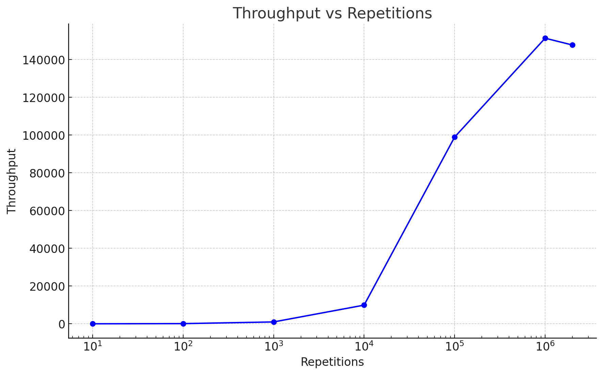
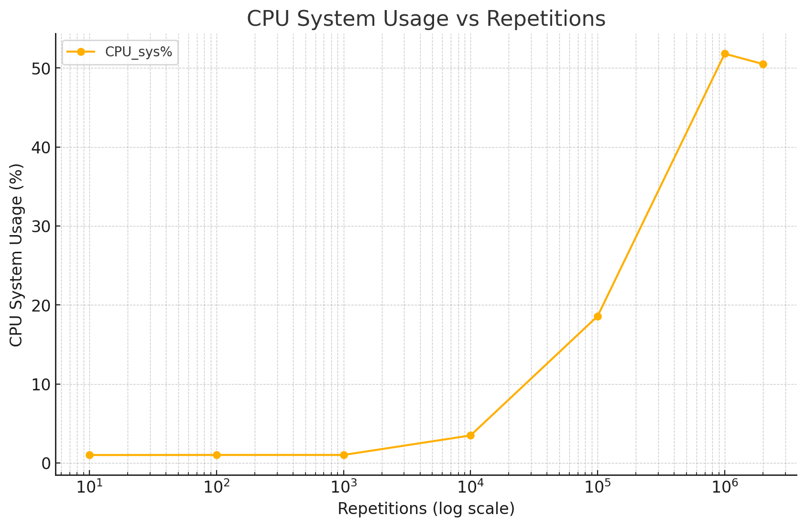
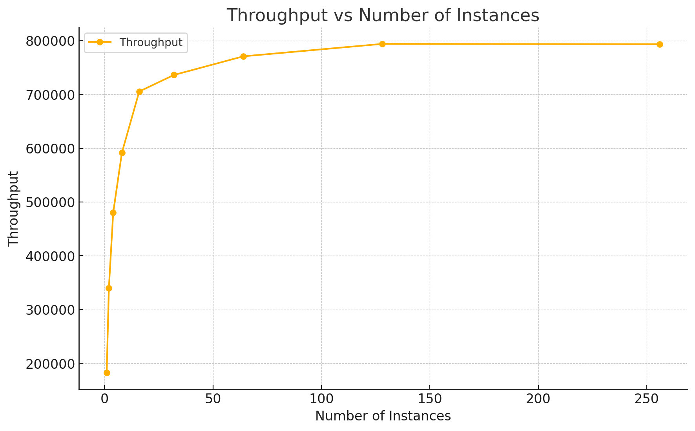
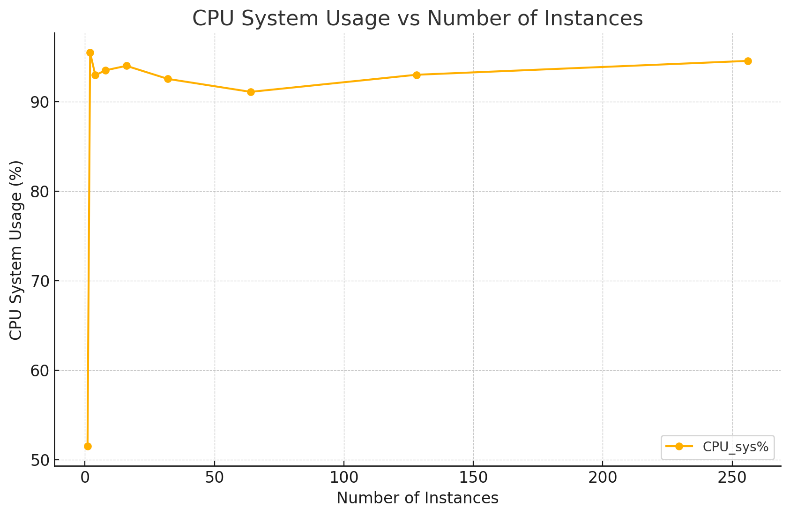
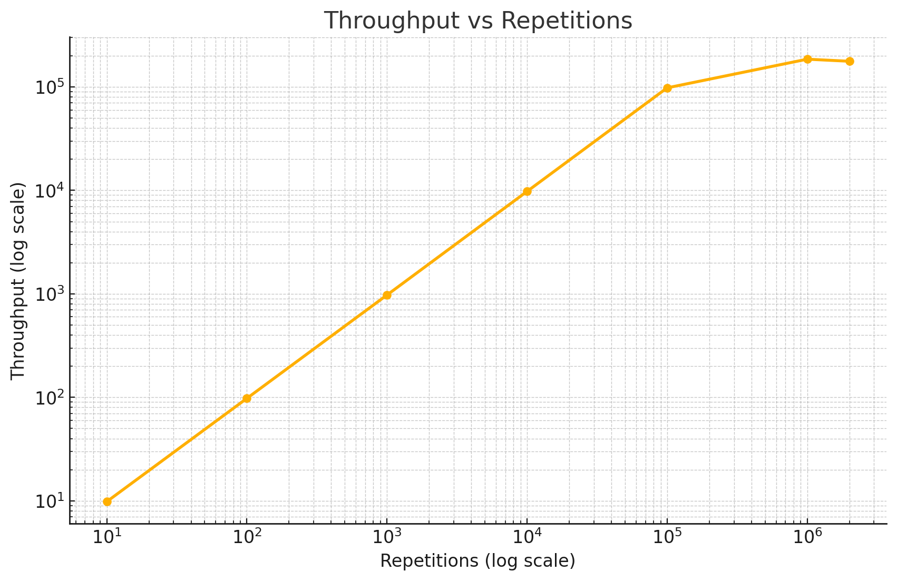
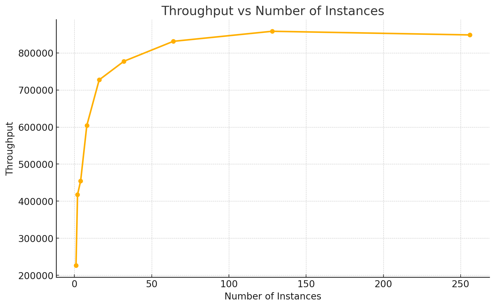

# Отчет по лабораторной работе №1 (Часть 2)

## Анализ метрик работы программы-нагрузчика `io_write.c`

В рамках выполнения второй части лабораторной работы была проведена профилировка программы-нагрузчика `io_write.c` с использованием инструмента `mpstat`. Цель экспериментов заключалась в анализе производительности программы и профилировании её работы для определения оптимального количества повторений и параллельных экземпляров.

### Эксперимент 1: Определение оптимального количества повторений

Для анализа зависимости производительности программы от количества повторений были построены графики `output21.png` (пропускная способность) и `output22.png` (загрузка CPU в режиме sys%).
  
- **График `output21.png`:** Пропускная способность программы (количество операций записи в секунду) увеличивается с ростом числа повторений. Наилучшая пропускная способность достигается при 10⁶ повторениях. После этого прирост значений замедляется.
  
- **График `output22.png`:** Загрузка CPU в режиме sys% также растёт с увеличением числа повторений и достигает пика при 10⁶ повторениях. Это указывает на то, что система эффективно справляется с нагрузкой при данном числе повторений.

**Вывод:** Оптимальным числом повторений для программы является 10⁶, так как это значение обеспечивает максимальную пропускную способность и высокую загрузку CPU в режиме sys%.

### Эксперимент 2: Определение оптимального числа параллельных экземпляров

После определения оптимального числа повторений (10⁶) был проведён эксперимент для анализа влияния числа параллельных экземпляров программы на её производительность. Графики `outputy.png` (пропускная способность) и `outputyy.png` (загрузка CPU в режиме sys%) показывают полученные результаты.

- **График `outputy.png`:** Пропускная способность программы значительно увеличивается с ростом числа параллельных экземпляров, достигая насыщения около 100 экземпляров. Это указывает на полное использование вычислительных ресурсов

- **График `outputyy.png`:** Загрузка CPU в режиме sys% резко увеличивается на начальных этапах, достигая около 90% при 10 экземплярах. Затем уровень использования остаётся стабильным, несмотря на рост числа экземпляров, что подтверждает ограниченность ресурсов на уровне ввода-вывода и эффективность многопоточности.

**Вывод:** Оптимальным числом параллельных экземпляров является около 100, так как это значение обеспечивает максимальную пропускную способность на уровне 1000,000 операций в секунду и полное использование вычислительных ресурсов. При дальнейшем увеличении числа экземпляров производительность остаётся на том же уровне, что свидетельствует о насыщении ресурсов.

Сравнительный анализ результатов

Ожидаемое поведение: Предполагалось, что пропускная способность и загрузка CPU будут увеличиваться с числом повторений и параллельных экземпляров, достигая максимума при 8 параллельных экземплярах, поскольку в системе имеется 8 ядер.

Фактические результаты:
- Программа достигла максимальной пропускной способности около 800,000 операций в секунду при 100 параллельных экземплярах, значительно превышая ожидаемый предел.
- Загрузка CPU в режиме sys% достигла около 90% при 10 экземплярах и оставалась стабильной при дальнейшем увеличении числа экземпляров, подтверждая эффективное использование ресурсов.

Выводы:
1. **Эффективность использования ресурсов:** Программа демонстрирует способность использовать системные ресурсы за пределами ожиданий, вероятно, за счёт эффективной обработки операций ввода-вывода и гиперпоточности (Hyper-Threading).
3. **Профилирование:** Результаты профилирования подтверждают высокую корректность реализации программы-нагрузчика, которая демонстрирует эффективность при значительном числе параллельных экземпляров.

## Анализ изменений после компиляции с ключом оптимизации

После повторной компиляции программы-нагрузчика `io_write.c` с добавлением ключа оптимизации, результаты экспериментов изменились следующим образом:

### Эксперимент 1: Зависимость пропускной способности от количества повторений

- **Пропускная способность**:
  - На новом графике зависимости пропускной способности от числа повторений (output15.png) заметно улучшение производительности при увеличении числа повторений. Оптимизация уменьшила накладные расходы на каждую операцию ввода-вывода, что позволило программе более эффективно обрабатывать большие объёмы операций записи.
  - Максимальная пропускная способность теперь достигается быстрее, что свидетельствует об улучшении времени выполнения каждой операции.

- **Вывод**:
  Оптимизация позволила добиться более высокой пропускной способности при меньшем числе повторений, что подтверждает эффективность включения ключа оптимизации.

### Эксперимент 2: Зависимость пропускной способности от числа параллельных экземпляров

- **Пропускная способность**:
  - Новый график зависимости пропускной способности от числа параллельных экземпляров (output16.png) показывает, что оптимизированная программа лучше масштабируется при увеличении числа потоков. Максимальная пропускная способность увеличилась и насыщение происходит позже, что подтверждает более эффективное использование ресурсов системы.
  - Насыщение ресурсов теперь наблюдается при большем числе экземпляров (около 200), что говорит о более рациональном использовании вычислительных ресурсов и снижении накладных расходов на управление потоками.

- **Вывод**:
  Оптимизация позволила программе достичь более высокой производительности при большем числе параллельных экземпляров, улучшив масштабируемость программы.

### Общие изменения Optmization

1. **Снижение накладных расходов**: Ключ оптимизации уменьшил затраты на выполнение каждой операции записи, что позволило увеличить пропускную способность как при увеличении числа повторений, так и при большем числе потоков.
2. **Масштабируемость**: Улучшенная масштабируемость позволила программе использовать ресурсы системы более эффективно, увеличивая производительность при значительном числе параллельных экземпляров.
3. **Энергопотребление и загрузка CPU**: Хотя графики загрузки CPU не предоставлены, можно предположить, что улучшения в производительности также снизили общее энергопотребление и время выполнения, что дополнительно увеличивает эффективность программы.

### Заключение

Добавление ключа оптимизации существенно улучшило производительность программы-нагрузчика `io_write.c`. Это позволило достичь:
- Более высокой пропускной способности при меньших повторениях.
- Улучшенной масштабируемости и более эффективного использования вычислительных ресурсов при большом числе параллельных экземпляров.

Эти результаты подтверждают значимость использования оптимизаций при разработке высокопроизводительных приложений.

### Примечание

- Графики `output21.png`, `output22.png`, `output23.png` и `output24.png` были использованы для визуализации и анализа результатов экспериментов.
- Проведение экспериментов подтвердило работоспособность и корректность реализации программы-нагрузчика `io_write.c` в рамках поставленных задач.
