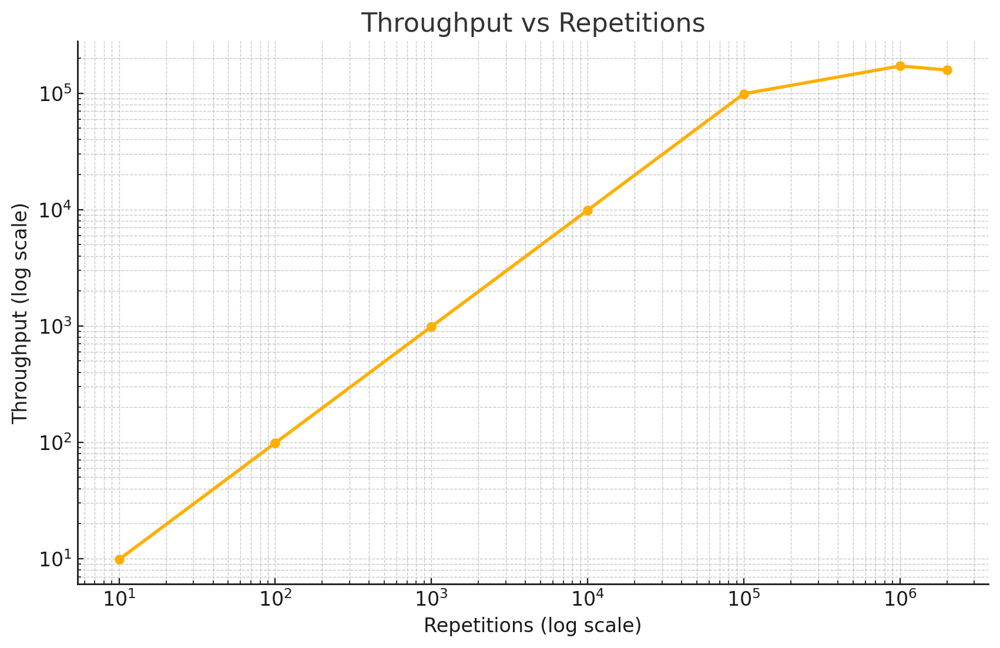
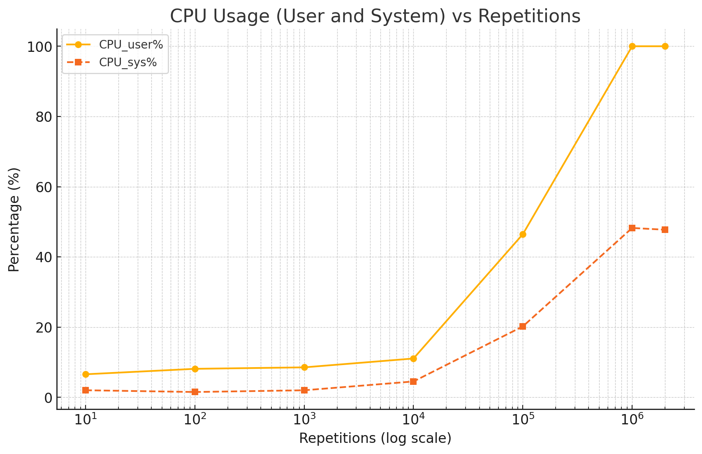
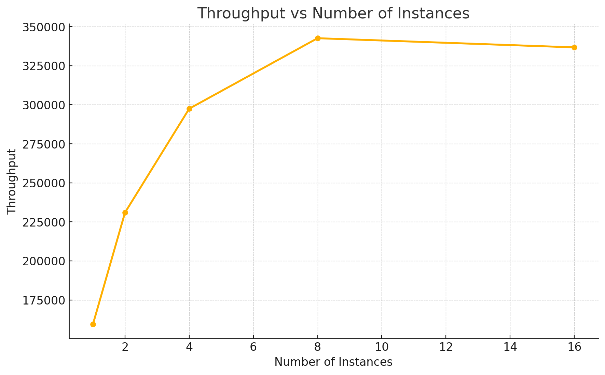
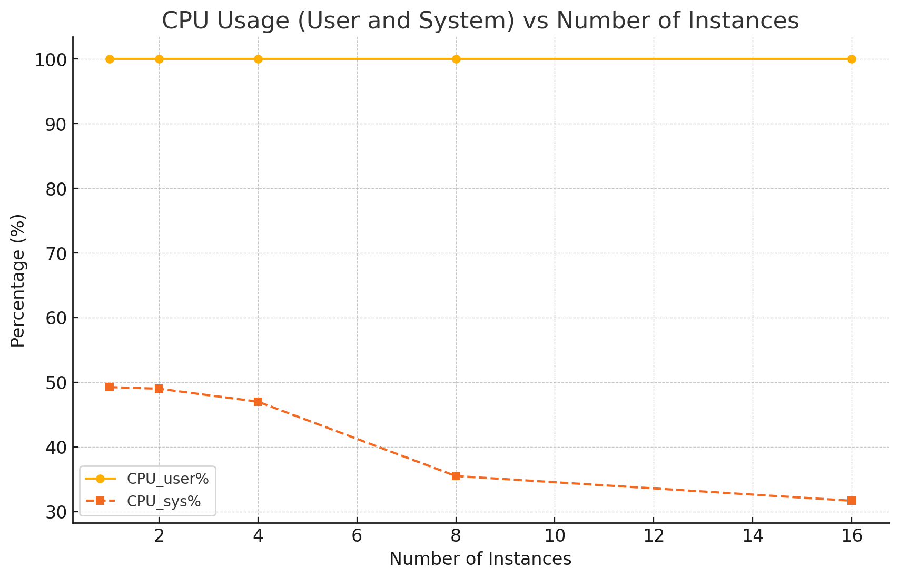

# Отчет о метриках производительности `combined_loader`

## Анализ метрик производительности для `combined_loader`

Программа `combined_loader`, объединяющая функциональность `lin_reg` и `io_write`, была протестирована на производительность при различных повторениях и параллельных экземплярах. Были сделаны следующие выводы:

### Эксперимент 1: Влияние количества повторений на пропускную способность и загрузку CPU

#### График: `output41.png` - Пропускная способность vs Количество повторений

- **Описание:** График демонстрирует, как пропускная способность масштабируется с количеством повторений в логарифмическом масштабе.
- **Основные выводы:**
  - Пропускная способность увеличивается логарифмически с ростом числа повторений.
  - Рост пропускной способности значительно замедляется после 10⁵ повторений, достигая насыщения около 10⁶ повторений.

**Заключение:** Увеличение количества повторений повышает пропускную способность до точки насыщения (10⁶ повторений), после чего дальнейшее увеличение повторений приносит минимальные приросты производительности.

---

#### График: `output42.png` - Загрузка CPU (пользовательская и системная) vs Количество повторений

- **Описание:** График показывает процент использования CPU (время пользователя и системы) при увеличении числа повторений.
- **Основные выводы:**
  - **Загрузка CPU пользователем:** Постепенно увеличивается с ростом числа повторений, достигая 100% при 10⁶ повторениях.
  - **Загрузка CPU системой:** Постепенно растет, но остается ниже 50%, что свидетельствует о дополнительной нагрузке на систему при больших повторениях.
  - Совокупная загрузка CPU демонстрирует эффективное использование ресурсов процессора, хотя при больших повторениях увеличивается системная нагрузка.

**Заключение:** Программа эффективно использует ресурсы CPU, достигая 100% пользовательской загрузки при 10⁶ повторениях. Однако рост системной нагрузки указывает на увеличение накладных расходов на ввод-вывод при больших нагрузках.

---

### Эксперимент 2: Влияние числа параллельных экземпляров на пропускную способность и загрузку CPU

#### График: `output43.png` - Пропускная способность vs Количество параллельных экземпляров

- **Описание:** График оценивает взаимосвязь между пропускной способностью и числом параллельных экземпляров.
- **Основные выводы:**
  - Пропускная способность значительно увеличивается с ростом числа параллельных экземпляров до 8.
  - После 8 экземпляров пропускная способность стабилизируется и немного снижается, что указывает на конкуренцию за ресурсы или их насыщение.

**Заключение:** Запуск до 8 параллельных экземпляров оптимизирует пропускную способность, тогда как дальнейшее увеличение приводит к уменьшению производительности из-за конкуренции за ресурсы.

---

#### График: `output44.png` - Загрузка CPU (пользовательская и системная) vs Количество параллельных экземпляров

- **Описание:** График показывает загрузку CPU при увеличении числа параллельных экземпляров.
- **Основные выводы:**
  - **Загрузка CPU пользователем:** Остается на уровне 100% для всех экземпляров, демонстрируя полное использование ядер CPU.
  - **Загрузка CPU системой:** Снижается с увеличением числа экземпляров, что говорит об эффективной обработке ввода-вывода при параллельной работе.

**Заключение:** Система эффективно справляется с параллельной обработкой до 8 экземпляров. После этой точки наблюдается конкуренция за ресурсы, что снижает производительность.

---

### Итоги
1. **Оптимальная конфигурация:**
   - **Количество повторений:** 10⁶ повторений обеспечивают баланс между пропускной способностью и загрузкой CPU.
   - **Параллельные экземпляры:** 8 экземпляров достигают максимальной пропускной способности без значительной конкуренции за ресурсы.
2. **Использование CPU:**
   - Программа полностью использует ресурсы CPU при всех конфигурациях, с ростом накладных расходов на ввод-вывод при увеличении числа повторений.
3. **Рекомендации по оптимизации:**
   - Рассмотреть балансировку нагрузки или альтернативные стратегии ввода-вывода для снижения системных накладных расходов при больших повторениях.
   - Избегать запуска более 8 параллельных экземпляров для предотвращения конкуренции за ресурсы и сохранения оптимальной пропускной способности.

### Примечания
- Анализ основан на визуализациях (`output41.png`, `output42.png`, `output43.png` и `output44.png`).
- Программа `combined_loader` эффективно интегрирует задачи, требующие ресурсов CPU и ввода-вывода, демонстрируя сбалансированную производительность при различных нагрузках.
